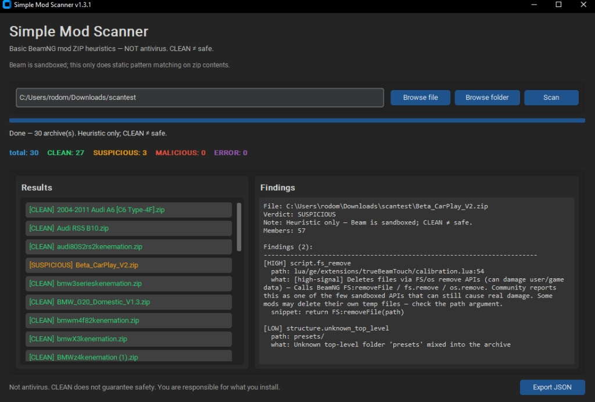

# Simple Mod Scanner

> **Reality check (read this first)**  
> Real malware in BeamNG mods is rare. From what’s been documented publicly, there have only been a handful of cases (e.g. some leaked mods years ago, and a repo mod from a compromised account). A lot of “malware mod” talk is scare — often aimed at keeping people off sketchy download sites full of ads. That does **not** mean you should be careless.
>
> **Practical rules:**
> - Prefer official / trusted sources when you can.
> - Only install **`.zip` mod archives** that look like normal BeamNG packs. Do **not** run `.exe`, `.msi`, “installers,” crack tools, or anything else that asks you to execute a downloaded file.
> - If a download is not a mod zip (or a repo you trust), don’t open it.
> - Keep real antivirus on. This tool is a quick second look, not protection.
>
> This scanner can only flag **obvious shady patterns** (executables inside the zip, WebSockets, file deletes, weird Lua, etc.). It cannot find clever hidden malware. **CLEAN ≠ safe.**

A **simple, best-effort** heuristic checker for [BeamNG.drive](https://www.beamng.com/) mod `.zip` files.

It looks for obviously suspicious stuff (executables, shell/FFI patterns, odd packing) **in memory** — nothing is extracted to disk.

### Example scan



*Example only — a folder of random mod zips for demo. I do **not** own or redistribute those mods; names shown are just whatever was in that test folder.*

## Important — how to read results

**This is not antivirus.**  
**A CLEAN result does not mean a mod is safe.**  
**A SUSPICIOUS / MALICIOUS result does not always mean it is malware.**

This tool uses basic static pattern matching. Clever malware can hide from it. False positives happen. You are responsible for what you install.

BeamNG itself is heavily sandboxed — many classic `os.execute`-style tricks are blocked in-game. This scanner still flags them as high-signal *intent*, and focuses on patterns that can still matter in-sandbox: **WebSockets**, **`FS:removeFile` / `fs.remove`**, remote script loads, FFI, and absolute file writes.

We test with **synthetic fixtures we wrote ourselves**. We do not distribute real malware samples.

## Features

- Scan a single `.zip` or a folder of mods
- Flag dangerous extensions (`.exe`, `.dll`, `.bat`, …) and PE (`MZ`) payloads
- Flag suspicious patterns in `.lua` / `.js` / `.html`
- Check for non-standard BeamNG folder packing
- Color-coded verdicts: **CLEAN** / **SUSPICIOUS** / **MALICIOUS**
- Export a JSON report

## Install (Windows — easiest)

1. Install **Python 3.10+** from https://www.python.org/downloads/  
   (check **Add python.exe to PATH** during setup)
2. Download / clone this repo
3. Double-click **`install.bat`**
4. Double-click **`run.bat`** to open the app

`run.bat` will run `install.bat` automatically if needed.

### Manual install (optional)

```powershell
git clone https://github.com/rod-dor/simple-mod-scanner.git
cd simple-mod-scanner
python -m venv .venv
.\.venv\Scripts\Activate.ps1
pip install -e .
python -m simple_mod_scanner
```

## Use

1. Browse a `.zip` or folder
2. Click **Scan**
3. Inspect findings
4. Optionally export JSON

## Verdicts

| Verdict | Meaning |
|---|---|
| CLEAN | No medium/high/critical hits (still not a safety guarantee) |
| SUSPICIOUS | Worth a closer look — network pipes, dynamic `load(cmd)`, obfuscation, odd JS paths, etc. Often legit advanced mods |
| MALICIOUS | Only **hard** signals: Windows executables/PE droppers, `os.execute` / `io.popen`, FFI / `package.loadlib`, ActiveX/WScript, shell binaries, zip path traversal |

**MALICIOUS is intentionally rare.** Things like WebSocket (live audio / DRM), `load(cmd)` triggers, or obfuscated Lua are **SUSPICIOUS**, not automatic malware.

## Found a malicious mod?

If you hit a mod that looks **actually malicious** (not just SUSPICIOUS / a false positive), contact me on Discord so I can inspect it and improve the scanner:

**Discord: `@rodomil`**

Please include the mod name/source if you can, and preferably the zip or a scan report export. Do **not** post malware publicly in GitHub issues.

## Development

```powershell
pip install -e ".[dev]"
pytest
```

## License

MIT — see [LICENSE](LICENSE). Provided as-is, with no warranty.
